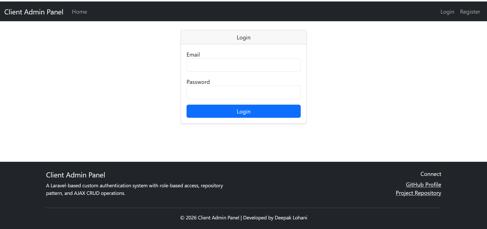
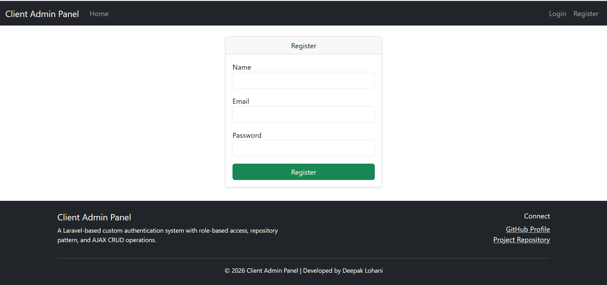
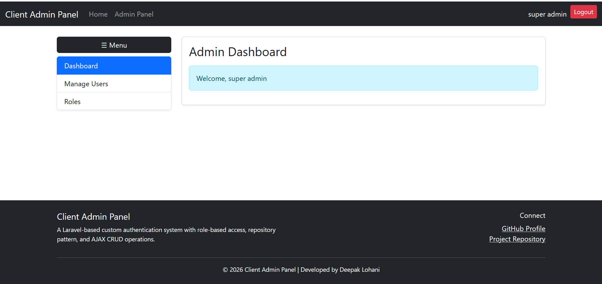
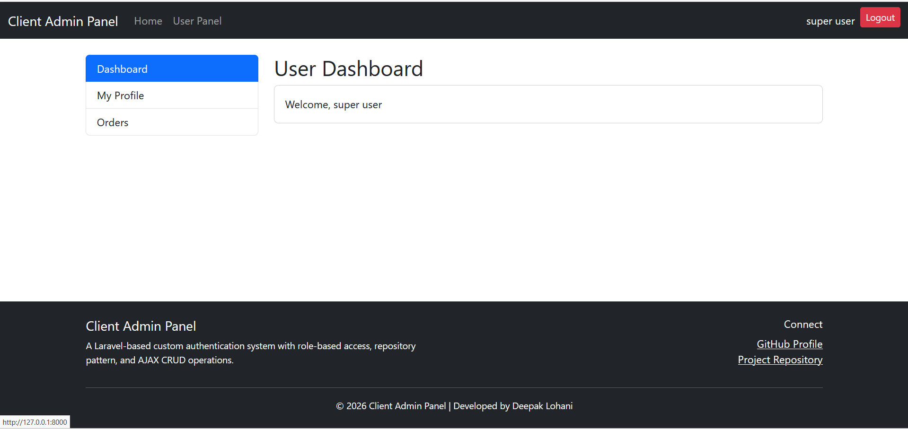
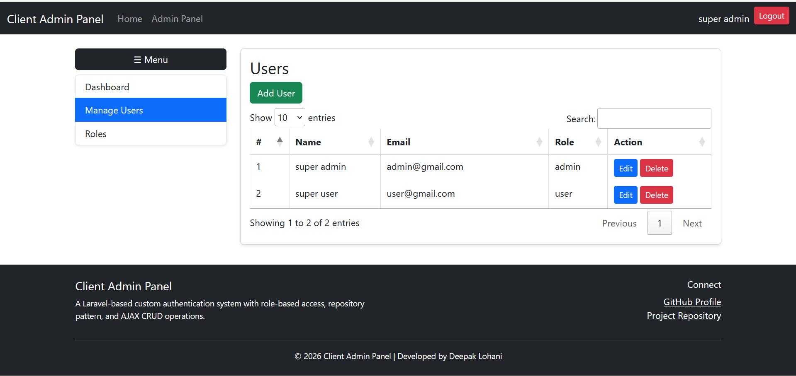
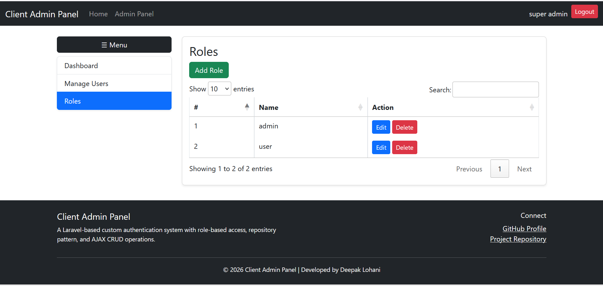
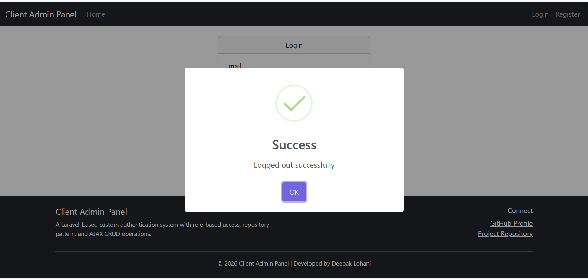

# 🚀 Laravel Custom Auth Admin Panel (Repository Pattern)

A complete Laravel project demonstrating **Custom Authentication**, **Role-Based Access (Admin/User)**, and **Repository Pattern Architecture** with **AJAX CRUD operations**.

This project is built for:

* 💼 Upwork Portfolio
* 🧪 Learning Clean Architecture
* ⚙️ Real-world Laravel Projects

---

# 📌 Features

## 🔐 Authentication System

* Custom Login & Register (No Laravel Breeze/UI)
* Secure password hashing
* Validation with error messages
* Session handling
* Role-based login redirect

---

## 👥 Role-Based System

* Admin & User roles
* Middleware protection
* Separate dashboards
* Route-level access control

---

## ⚙️ Clean Architecture

* Repository Pattern
* Service Layer
* Separation of concerns
* Scalable structure

---

## 🛠️ Admin Panel

* Users CRUD (AJAX)
* Roles CRUD (AJAX)
* Assign roles dynamically
* No page reload operations

---

## ⚡ UI/UX

* Bootstrap 5 (No NPM)
* DataTables (search + pagination)
* SweetAlert2 (alerts & confirmations)
* Sidebar layout (Admin/User)
* Top Navbar
* Loader system

---

# 🧰 Tech Stack

* Laravel 10+
* PHP 8+
* MySQL
* Bootstrap 5
* jQuery
* DataTables
* SweetAlert2

---

# ⚙️ Installation Guide (Step-by-Step)

## 1️⃣ Clone Repository

```bash id="c1"
git clone https://github.com/deepak18121988/laravel-custom-auth-admin-panel-repository-pattern.git
cd laravel-custom-auth-admin-panel-repository-pattern
```

---

## 2️⃣ Install Dependencies

```bash id="c2"
composer install
```

---

## 3️⃣ Create Environment File

```bash id="c3"
cp .env.example .env
```

---

## 4️⃣ Configure Database

Open `.env` file and update:

```env id="c4"
DB_DATABASE=your_database_name
DB_USERNAME=root
DB_PASSWORD=
```

---

## 5️⃣ Generate Application Key

```bash id="c5"
php artisan key:generate
```

---

## 6️⃣ Run Migrations & Seeders

```bash id="c6"
php artisan migrate --seed
```

👉 This will create:

* users table
* roles table
* default admin & user

---

## 7️⃣ Start Development Server

```bash id="c7"
php artisan serve
```

Open in browser:

```id="c8"
http://127.0.0.1:8000
```

---

# 🔑 Demo Credentials

| Role  | Email                                     | Password |
| ----- | ----------------------------------------- | -------- |
| Admin | [admin@gmail.com](mailto:admin@gmail.com) | 123456   |
| User  | [user@gmail.com](mailto:user@gmail.com)   | 123456   |

---

# 📸 Screenshots

> 📂 Images path: `public/screenshots/`

---

### 🔐 Login Page



---

### 📝 Register Page



---

### 🧑‍💻 Admin Dashboard



---

### 👤 User Dashboard



---

### 👥 Users CRUD



---

### 🔑 Roles CRUD



---

### ⚡ SweetAlert Notifications



---

# 📂 Project Structure

```id="c9"
app/
 ├── Http/Controllers
 │   ├── Admin
 │   ├── User
 │   └── AuthController.php
 │
 ├── Services
 ├── Repositories

resources/views/
 ├── layouts
 ├── admin
 ├── user
 ├── auth

public/
 ├── js/common.js
 ├── screenshots/
```

---

# 🔥 Key Highlights

✔ Custom Auth (No Breeze/UI)
✔ Role-based Admin Panel
✔ AJAX CRUD (No Reload)
✔ SweetAlert Global Notifications
✔ Clean Architecture (Service + Repository)
✔ Beginner Friendly Setup

---

# 🧠 Learning Outcomes

* How to build custom auth in Laravel
* Role-based middleware system
* Repository pattern implementation
* AJAX CRUD with Fetch API
* Clean project structure

---

# 🔗 Project Links

👉 GitHub Repo:
https://github.com/deepak18121988/laravel-custom-auth-admin-panel-repository-pattern

👉 Developer Profile:
https://github.com/deepak18121988

---

# 👨‍💻 Author

**Deepak Lohani**
Laravel Developer

---

# ⭐ Support

If you like this project:

⭐ Star the repository
🔁 Share with others
💼 Use it in your projects

---

# 🚀 Future Improvements

* Permission-based roles (RBAC)
* API authentication (Sanctum)
* Charts dashboard
* Multi-language support
* Dark mode UI

---

🔥 Built for real-world use & Upwork portfolio
